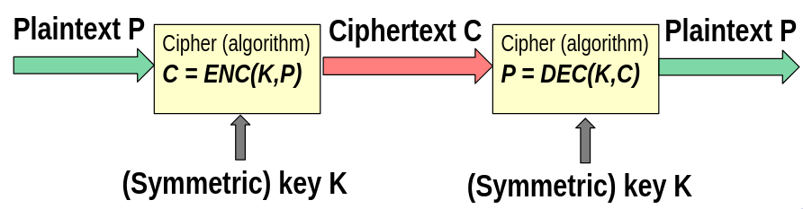
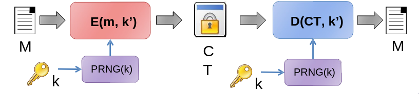

# Encryption

- _plaintext_: testo in chiaro
- _cyphertext_: testo cifrato

In un cifrario a sostituzione abbiamo due componenti principali: la permutazione e il modo di operare (l'algoritmo di cifratura).

Una permutazione deve avere le seguenti proprietà:

- Deve essere determinata dalla chiave;
- Chiavi diverse devono portare a permutazioni diverse;
- La permutazione deve sembrare casuale.

Una permutazione avente le seguenti proprietà è una _permutazione sicura_, che è necessaria per un cifrario ma non sufficiente.

Il modo di operare di un cifrario rappresenta l'algoritmo con cui vengono cifrate le lettere, ed ha il ruolo di mitigare il problema delle lettere duplicate, in quanto portano a pattern facili da trovare. Si usano permutazioni diverse per le lettere duplicate.

## One Time Pad - Un cifrario perfettamente sicuro

\[
C = P \oplus K \\
P = C \oplus K
\]

dove $K$ è una chiave random e `len(C) = len(P) = len(K)`. Questo cifrario è definito sicuro in quanto una chiave può essere usata al massimo una volta, non è possibile usare una chiave per cifrare più di un messaggio.

- Trivial **Know Plaintext Attack (KPA)**

\[
    C_1 \oplus C_2 = (P_1 \oplus K) \oplus (P_2 \oplus K) = (P_1 \oplus P_2) \oplus (K \oplus K) = P_1 \oplus P_2
\]

Questa tipologia di cifrario è inconveniente e poco pratico, in quanto per cifrare un messaggio di $N$ bit, servono $N$ bit aggiuntivi di memoria per memorizzare la chiave.

## Random vs Pseudo Random

- **PRNG**: è un algoritmo, non è del tutto randomico
- **TRNG**: la casualità è estratta da fenomeni fisici, per esempio il rumore termico dei resistori, o il rumore atomosferico. (Non riproducibile).

## Encryption Security

Ora, dobbiamo dare una definizione formale di **Sicurezza Crittografica**. Intuitivamente, un cifrario è considerato sicuro se, anche conoscendo molti esempi di messaggi e relative cifrature, un attaccante **non riesce a imparare nulla** che gli permetta di prevedere o dedurre qualcosa su altri messaggi o altre cifrature. Questo concetto è la base dell'idea di **indistinguibilità (IND-CPA)**.
Nella pratica, non si può parlare di sicurezza in modo astratto, ma rispetto a un certo tipo di attacco o per un certo obiettivo. Quindi:

- **Attack Model**: specifica quali risorse o poteri ha l'attaccante.
- **Security Goals**: quali proprietà vogliamo proteggere (riservatezza, autenticità, integrita, ecc.) e che cosa significherebbe un attacco riuscito.

Quindi, **sicurezza = attack model + security goal**.

### Attack Models

- La sicurezzia di un cifrario deve dipendere solo dalla chiave e non dalla segretta del cifrario stesso.

**Modelli BlackBox**

- **Cyphertext-Only Attackers (COA)**: L'attaccante vede solo il testo cifrato, non conosce i messaggi in chiaro e nè come sono stati scelti (attaccante passivo).
- **Known-Plaintext Attack (KPA)**: L'attacante conosce alcune coppie **plaintext-ciphertext**, ed è in grado di analizzare il legame tra messaggi e testo cifrato (attaccante passivo).
- **Chosen-Plaintext Attack (CPA)**: L'attaccante può scegliere i **plaitext** e ottenere le loro cifrature (ha accesso all'oracolo di cifratura). È un attaccante attivo in quanto è in grado di interagire con il sistema e influnzare il processo di cifratura.
- **Chosen-Ciphertext Attack (CCA)**: L'attaccante può scegliere **ciphertext** e ottnere le loro decifrature. È il modello più potente e rappresenta i casi in cui l'attaccante può inviare ciphertext a un sistema che risponde con errori o testi decifrati.

| Modello | Accesso dell’attaccante            | Tipo    | Esempio                   |
| ------- | ---------------------------------- | ------- | ------------------------- |
| **COA** | Solo ciphertext                    | Passivo | Eavesdropping             |
| **KPA** | Coppie plaintext–ciphertext note   | Passivo | Analisi di messaggi noti  |
| **CPA** | Oracolo di cifratura               | Attivo  | API di cifratura pubblica |
| **CCA** | Oracolo di cifratura e decifratura | Attivo  | Padding oracle, DRM       |

### Security Goals

**Indistinguishability (IND)**

Un cifrario non deve rivelare nessuna informazione sul plaintext. Anche se l'attaccante può scegliere due messaggi e ricevere la cifratura di uno dei due (scelto a caso), non deve poter capire quale dei due è stato cifrato meglio che un lacio di moneta. Ad esempio

1. L’attaccante sceglie due plaintext $P_0$ e $P_1$.
2. Il sistema cifra uno dei due: $C = E(K, P_b)$, con $b \in \{0, 1\}$ scelto a caso.
3. L'attaccante riceve $C$ e deve indovinare se proviene $P_0$ o $P_1$.
4. Se non può fare meglio del 50%, allora il cifrario è **IND-secure**.

**Non-malleability (NM)**

Un attaccante non deve essere in grado di modificare un ciphertext in modo che, una volta decifrato, il nuovo plaintext $P_2$ sia legato in modo prevedibile al plaintext originale $P_1$.

La convenzione è: $GOAL - MODEL$. Ad esempio IND-CPA denota la indistinguibilità contro attacchi di tipo chosec-plaitext.

La **IND-CPA** è il requisito standard di sicurezza per i cifrari moderni. Significa che un cifrafio deve essre indistinguibile sotto attaco di tipo chosen plaintext. Questo è il modo formale di dire che il sistema deve garantire "semantic security". In altre parole, anche se l'attaccante può scegliere liberamente messaggi da cifrare (ha accesso ad un encryption oracle), non deve riuscire a ottenere alcuna informazione utile dai ciphertext.

Questo requisito ha due implicazioni maggiori:

1. La cifratura deve essere randomizzata, ovvero, se un plaintext è cifrato due volte non deve produrre lo stesso ciphertext. Ogni cifratura deve quindi usare un **valore casuale (IV, initialization vector/nonce)**.
2. Le ripetizioni nel plaitext non devono apparire nel ciphertext. Questo significa che anche all'interno dello stesso messaggio, porzioni uguali di testo non devono risultare uguali dopo la cifratura.

## Stream Ciphers

Un **cifrario a flusso** è un cifrario simmetrico nel quale i simboli (i bit) che codificano il testo in chiaro sono cifrati indipendentemente l'uno dall'altro e nel quale la trasformazione dei simboli successivi varia con il procedere della cifratura.

Essi generano una sequenza di bit pseudocasuali chiamata *keystream*, che viene combinata (tramite operazione XOR) con il testo in chiaro per cifrare, e con il testo cifrato per decifrare.  

La funzione del cifrario opera così:

- Keystream: $KS = SC(K, N)$
- Cifratura: $C = P \oplus KS$
- Decifratura: $P = C \oplus KS$

Poiché in entrambi i casi si usa la stessa operazione XOR con lo stesso keystream, le funzioni di cifratura e decifratura coincidono. Per questo motivo molte librerie crittografiche offrono un’unica funzione che serve per entrambe le operazioni.

I cifrari a flusso possono essere visti come approssimazioni del cifrario One-Time Pad (OTP). Da notare che la differenza tra i due è che nel OTP viene usata una chiave random, mentre nei cifrari a flusso abbiamo un keystream random.

Infatti, nei **cifrari a flusso** è fondamentale non riutilizzare la stessa coppia chiave–nonce.  

Se si cifra due volte con la stessa chiave $K_1$ e lo stesso nonce $N_1$, si riutilizza lo stesso **keystream** $KS$, e questo compromette la sicurezza:  

- Primo messaggio: $C_1 = P_1 \oplus KS$  
- Secondo messaggio: $C_2 = P_2 \oplus KS$  

Conoscendo $P_1$, si può ricavare $P_2 = C_1 \oplus C_2 \oplus P_1$, quindi il secondo messaggio diventa decifrabile.

!!! note
    Il nome "nonce" è in realtà l'abbreviazione di "number used only once" (numero utilizzato una sola volta). Nel contesto dei cifri a flusso, viene talvolta chiamato IV, per valore iniziale.

slide 6, pdf 03
libro seriouscryptography, pp 79