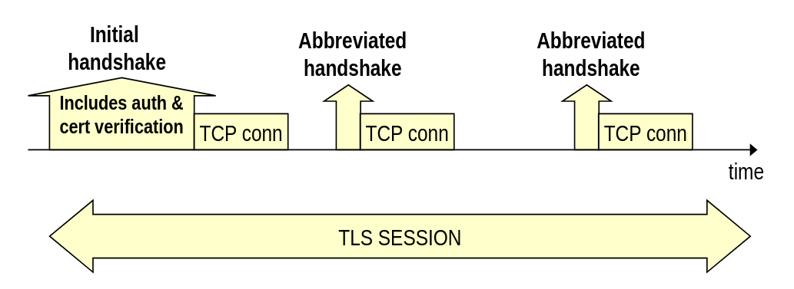
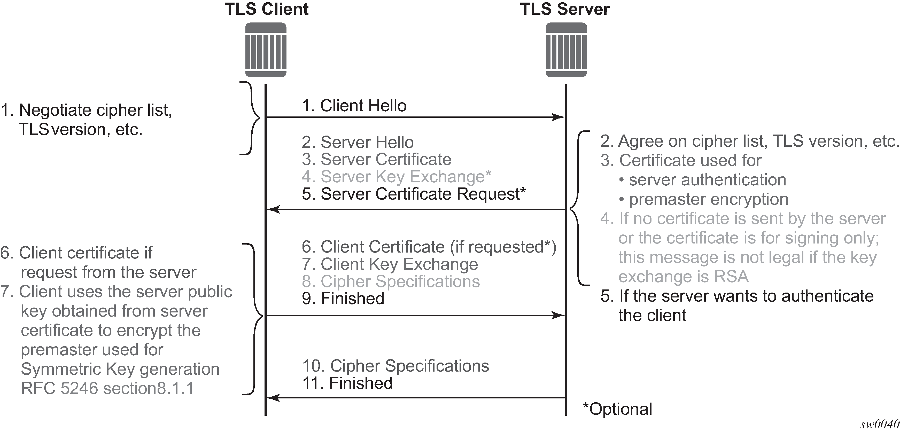

# TLS Handshake

## Quando Avviene l'Handshake TLS

L'handshake del protocollo **TLS (Transport Layer Security)**, essenziale per stabilire una comunicazione sicura, avviene **ogni volta che viene stabilita una nuova connessione TCP**.

* **Accesso ai Siti Web:** Avviene tipicamente all'inizio, quando si collega a un **sito web** protetto da HTTPS (che utilizza TLS).
* **Connessioni Separate (Esempio HTTP Obsoleto):** Nelle **vecchie versioni del protocollo HTTP** che aprivano una connessione TCP separata per scaricare ogni singola risorsa (come immagini, fogli di stile, script), l'handshake TLS veniva **eseguito per ciascuna di quelle connessioni**.

L'handshake TLS (Transport Layer Security) non è sempre uguale: il primo è **complesso**, mentre i successivi possono essere **più semplici** sfruttando sessioni già stabilite.

L'handshake iniziale è l'unico che deve effettuare il lavoro **completo** di stabilire tutte le **chiavi segrete** e i parametri di sicurezza necessari per la sessione. Gli handshake successivi, se sfruttano la ripresa di sessione (session resumption), possono **saltare** la maggior parte di queste fasi.

Il primo e più complesso handshake deve eseguire le seguenti quattro azioni fondamentali: 

* **Autenticazione Reciproca (Mutual Authentication):**
    * L'azione principale è che il **Client deve autenticare il Server** (verifica del certificato del server).
    * L'autenticazione del Client da parte del Server (detta **mTLS** - Mutual TLS) è meno comune nei siti web, ma è spesso utilizzata in contesti specializzati, come le comunicazioni tra servizi nel **cloud**.
* **Negoziazione degli Algoritmi (Cipher Suite Negotiation):**
    * Questa è la fase più critica, in cui Client e Server si accordano sugli **algoritmi crittografici** (ad esempio, per la cifratura, l'hashing e lo scambio di chiavi) da utilizzare per la comunicazione.
    * È essenziale che la negoziazione sia sicura per prevenire **"Downgrade Attack"**. In questi attacchi, un malintenzionato tenta di forzare l'uso di un algoritmo crittografico **obsoleto e vulnerabile** ("broken"), anche se il Server ne supporta di più recenti (come AES), compromettendo la sicurezza.
* **Scambio di Valori Casuali:**
    * Vengono scambiati valori **random** generati dal Client e dal Server. Questi valori sono fondamentali per garantire che la chiave di sessione generata sia sempre unica e imprevedibile.
* **Scambio Sicuro di Chiavi Segrete:**
    * Sfruttando la **crittografia asimmetrica** (o a chiave pubblica), Client e Server scambiano in modo sicuro le informazioni che permetteranno loro di derivare la **chiave segreta simmetrica** che verrà utilizzata per cifrare i dati di tutta la sessione.

Il cuore della sicurezza TLS risiede nella distinzione tra la **Sessione TLS**, che è un contesto di sicurezza generale e duraturo, e le singole **Connessioni TCP** che ne fanno parte. Soltanto la **prima Connessione TCP** richiede un **Handshake TLS completo** , il processo più complesso che stabilisce tutti i parametri di sicurezza, autentica il server e negozia le chiavi segrete iniziali utilizzando la crittografia asimmetrica. Le **Connessioni TCP successive** all'interno della stessa Sessione evitano questo onere grazie al **"re-keying"** (*Session Resumption*): pur riutilizzando il contesto di sicurezza negoziato in precedenza, generano **nuove chiavi segrete simmetriche** specifiche per quella connessione. Questo meccanismo garantisce che ogni singola Connessione TCP operi con chiavi diverse, aumentando la sicurezza complessiva e limitando il danno in caso di compromissione di una singola sessione.

## Messaggi TLS Handshake

