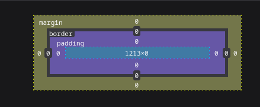

# Teoria

## Teoria HTTP

### 1. HTTP

HTTP è un protocollo a livello di applicazione e permette ai browser di comunicare con i server dei siti web per ricevere e visualizzare le pagine. Lo scambio di messaggi avviene tra client (browser) e server mediante richieste e risposte HTTP.
È un protocollo `stateless` ovvero ciascuna richiesta http è indipendente una dall'altra e il server non ne tiene traccia.

#### Formato Richiesta HTTP

- Linea di richiesta: `GET /api/products HTTP/1.1\n`
- Headers: `Host: localhost:3000\n`, `Connection: keep-alive\n`
- Riga vuota: `\n`

Nelle richieste `POST` è presente anche il body, nel quale ci sono i dati da inviare al server, di solito in formato JSON.

I metodi HTTP per effettuare le richieste sono:

1. `GET`: usato dal client per richiedere una risorsa al server, `GET http://localhost:3000/api/products`.
2. `HEAD`: il messaggio di risposta è simile a quella che restituirebbe il `GET`, il server non deve restituire il body.
3. `POST`: usato dal client per inviare dati al server, dati che sono passati nel body della richiesta.
4. `PUT`: usato dal client per modificare o crere una risorsa sul server.
5. `DELETE`: usato dal client per eliminare una risorsa presente nel server.
6. `PATCH`: usata per modificare una risorsa specificata nella URI.
7. `OPTIONS`: viene utilizzato per chiedere al server quali operazioni sono permesse su una risorsa o su un intero endpoint, è usato specialmente nelle applicazioni che comunicano traimite API.

#### Formato Risposte HTTP

- Linea di stato: `HTTP/1.1 200 OK\n`
- Headers: `Content-Type: application/json; charset=UTF-8\n`
- Riga vuota: `\n`
- Body: `{"id": 3}`

Il server poi in base al tipo di richiesta effettuata dal client, risponde con la risorsa richiesta insieme ad un codice di stato. Questi codici variano in base al tipo di richiesta effettuata dal client e al tipo di risposta del server. Alcuni codici importanti sono:

| Codice | Categoria        | Significato               | Descrizione                                                         |
|--------|------------------|---------------------------|---------------------------------------------------------------------|
| 200    | Successo         | OK                        | La richiesta è andata a buon fine.                                  |
| 201    | Successo         | Created                   | La risorsa è stata creata con successo (es. dopo un POST).          |
| 204    | Successo         | No Content                | La richiesta è andata bene, ma non c'è nulla da restituire.         |
| 301    | Reindirizzamento | Moved Permanently         | L'URL richiesto è stato spostato in modo permanente.                |
| 302    | Reindirizzamento | Found (Moved Temporarily) | L'URL è stato spostato temporaneamente.                             |
| 304    | Reindirizzamento | Not Modified              | La risorsa non è cambiata (usato per caching).                      |
| 400    | Errore client    | Bad Request               | La richiesta ha un formato errato o non può essere capita.          |
| 401    | Errore client    | Unauthorized              | Richiede autenticazione (ma non fornita o errata).                  |
| 403    | Errore client    | Forbidden                 | L’accesso è vietato, anche se autenticato.                          |
| 404    | Errore client    | Not Found                 | La risorsa richiesta non esiste.                                    |
| 405    | Errore client    | Method Not Allowed        | Il metodo HTTP usato non è permesso per quella risorsa.             |
| 409    | Errore client    | Conflict                  | C’è un conflitto con lo stato attuale della risorsa (es. doppione). |
| 500    | Errore server    | Internal Server Error     | Errore generico del server.                                         |
| 502    | Errore server    | Bad Gateway               | Il server ha ricevuto una risposta non valida da un altro server.   |
| 503    | Errore server    | Service Unavailable       | Il server non è disponibile (sovraccarico o in manutenzione).       |
| 504    | Errore server    | Gateway Timeout           | Il server non ha ricevuto risposta in tempo da un altro server.     |

| Header                       | Tipo      | Significato breve                                                    |
|------------------------------|-----------|----------------------------------------------------------------------|
| Host                         | Richiesta | Indica il dominio al quale si vuole accedere.                        |
| Content-Type                 | Entrambi  | Specifica il tipo di contenuto (es. application/json, text/html).    |
| Authorization                | Richiesta | Contiene le credenziali (es. token Bearer o Basic) per autenticarsi. |
| Accept                       | Richiesta | Indica il formato che il client si aspetta nella risposta.           |
| User-Agent                   | Richiesta | Descrive il client (browser, app, ecc.) che fa la richiesta.         |
| Origin                       | Richiesta | Usato nelle CORS: indica da dove proviene la richiesta.              |
| Access-Control-Allow-Origin  | Risposta  | Indica quali origini sono autorizzate (usato nelle CORS).            |
| Access-Control-Allow-Methods | Risposta  | Specifica i metodi HTTP consentiti per una risorsa.                  |
| Set-Cookie                   | Risposta  | Usato per inviare cookie dal server al client.                       |
| Location                     | Risposta  | Indica l’URL verso cui reindirizzare (usato nei 3xx).                |
| Cache-Control                | Risposta  | Controlla il comportamento della cache.                              |
| Content-Length               | Risposta  | Indica la dimensione del corpo della risposta, in byte.              |

### 2. CORS

Le `CORS (Cross-Origin Resource Sharing)` sono un meccanismo di sicurezza fondamentale nel mondo del web moderno, e servono per controllare l’accesso tra risorse che provengono da origini diverse. È uno standard W3C che permette a un sito web di accedere a risorse ospitate su un dominio diverso.

Supponiamo che la seguente app `(https://frontend.com)` voglia chiamare un'API `(https://api.backend.com)`. Il browser invia una richiesta e, prima ancora di permettere la vera comunicazione, può fare una richiesta preliminare, detta `preflight request`, con il metodo `OPTIONS`.

Questa richiesta chiede al server:

- Se è sicuro ricevere richieste da `https://frontend.com`
- Se può usare certi metodi (es. POST, PUT)
- Se può includere intestazioni particolari (es. Authorization, Content-Type)

Il server poi risponde con degli `header CORS`, i più importanti sono:

| Header                             | Significato                                                                  |
|------------------------------------|------------------------------------------------------------------------------|
| `Access-Control-Allow-Origin`      | Indica da quale origine si accettano richieste (es. `https://frontend.com`). |
| `Access-Control-Allow-Methods`     | Elenca i metodi HTTP consentiti (es. `GET, POST, PUT`).                      |
| `Access-Control-Allow-Headers`     | Specifica quali header sono ammessi nella richiesta.                         |
| `Access-Control-Allow-Credentials` | Se è `true`, consente l’uso di cookie o header di autenticazione.            |

Se la richiesta è “semplice” (cioè un GET o POST senza header particolari), allora non c’è bisogno del preflight.

### 3. REST API

Le `REST API (Representational State Transfer Application Programming Interface)` sono uno stile architetturale che definisce un metodo semplice e leggibile di comunicazione tra un applicazione (front-end) e un server mediante il protocollo `HTTP`. Tali pricipi architetturali sono:

- Usa il protocollo HTTP.
- Lavora con risorse, che sono entità come "utenti", "prodotti", etc...
- Ogni risorsa è identificata in modo univoco da un'URL.
- I dati sono di solito scambiati in formato JSON
- Si basa sui metodi HTTP (GET, POST, DELETE, PUT) ognuno con un significato specifico.

Per esempio, le API REST di un app che gestisce libri possono essere:

| Metodo | URL         | Azione                                |
|--------|-------------|---------------------------------------|
| GET    | `/libri`    | Ottieni la lista di tutti i libri     |
| GET    | `/libri/42` | Ottieni il libro con ID 42            |
| POST   | `/libri`    | Crea un nuovo libro                   |
| PUT    | `/libri/42` | Aggiorna **tutto** il libro con ID 42 |
| PATCH  | `/libri/42` | Aggiorna **una parte** del libro      |
| DELETE | `/libri/42` | Cancella il libro con ID 42           |

Le principali caratteriste dell'architettura REST API sono:

- È **semplice** da capire e usare (basta conoscere le URL e i metodi).
- È **indipendente** dalla tecnologia (un'app mobile in Swift può parlare con un server in Python, ad esempio).
- È **scalabile**: funziona bene anche quando il progetto cresce molto.
- È **stateless**: ogni richiesta contiene tutte le informazioni necessarie, non si mantiene uno "stato" lato server, il che semplifica la gestione.

## Teoria HTML

`HTML (HyperText Markup Language)` è un linguaggio di `markup` che serve per definire la struttura di una pagina web. Non è un linguaggio di programmazione: non contiene logica, ma dice al browser cosa mostrare (testi, immagini, link...) e come sono organizzati i contenuti.

In HTML, semantica significa usare i tag giusti per rappresentare il significato del contenuto, non solo per farlo apparire in un certo modo. Per esempio, invece di usare un generico `<div>` per tutto, possiamo usare tag come:

| Tag                         | Significato                                                          |
|-----------------------------|----------------------------------------------------------------------|
| `<main>`                    | Contenuto principale della pagina (una sola volta per pagina)        |
| `<section>`                 | Blocco di contenuto logico, spesso con un titolo (`<h2>`, `<h3>`...) |
| `<article>`                 | Contenuto indipendente e riutilizzabile (come un post o un commento) |
| `<aside>`                   | Contenuto secondario o correlato (sidebar, pubblicità, note)         |
| `<header>`                  | Intestazione della pagina o di una sezione                           |
| `<footer>`                  | Informazioni finali: autore, copyright, link legali                  |
| `<nav>`                     | Contiene link di navigazione tra sezioni o pagine                    |
| `<figure>` e `<figcaption>` | Per immagini con descrizione o didascalia                            |
| `<time>`                    | Per indicare date o orari, utile per motori di ricerca e calendari   |

L'HTML semantico è importante perché:

1. **Accessibilità**: i lettori di schermo possono "capire" la struttura della pagina, aiutando chi ha disabilità visive.
2. **SEO** (posizionamento sui motori di ricerca): Google e altri motori interpretano meglio il contenuto e lo classificano in modo più preciso.
3. **Manutenibilità**: è più facile leggere, modificare e collaborare su un codice ben strutturato.
4. **Compatibilità futura**: gli standard del web evolvono, ma l’HTML semantico è progettato per durare nel tempo.

[Tag HTML](https://www.w3schools.com/html/default.asp)

### Form

Una form in HTML è un contenitore che permette all’utente di inserire dati e poi inviarli al server. All’interno ci sono vari campi di input (testo, checkbox, pulsanti…) che l’utente compila.

| Tipo (`type`) | Descrizione                                                |
|---------------|------------------------------------------------------------|
| `text`        | Campo di testo a una riga                                  |
| `password`    | Campo di testo con caratteri nascosti                      |
| `email`       | Campo per inserire un indirizzo email (valida formato)     |
| `number`      | Campo per numeri (può avere min/max)                       |
| `tel`         | Campo per numero di telefono                               |
| `url`         | Campo per un indirizzo web                                 |
| `date`        | Selettore per una data (con calendario)                    |
| `time`        | Selettore per un orario                                    |
| `checkbox`    | Casella da spuntare (scelte multiple)                      |
| `radio`       | Pulsante di scelta esclusiva tra opzioni                   |
| `range`       | Slider per scegliere un valore entro un intervallo         |
| `color`       | Selettore per scegliere un colore                          |
| `file`        | Campo per caricare file                                    |
| `submit`      | Pulsante per inviare la form                               |
| `reset`       | Pulsante per **svuotare tutti i campi** del modulo         |
| `hidden`      | Campo invisibile usato per passare dati nascosti al server |
| `button`      | Pulsante generico (non invia la form di default)           |

| Tag          | Descrizione                                                   |
|--------------|---------------------------------------------------------------|
| `<textarea>` | Campo di testo multilinea (per messaggi, commenti, ecc.)      |
| `<select>`   | Menù a tendina per scegliere un’opzione                       |
| `<option>`   | Singola voce dentro il `<select>`                             |
| `<label>`    | Etichetta descrittiva per un campo (migliora l’accessibilità) |
| `<fieldset>` | Raggruppa visivamente e logicamente un insieme di campi       |
| `<legend>`   | Titolo del gruppo di campi dentro un `<fieldset>`             |

## Teoria CSS

`CSS (Cascading Style Sheets)` è il linguaggio che serve a definire lo stile di una pagina HTML: colori, font, dimensioni, layout, spaziatura, animazioni e molto altro.

- Inline
- Interno (dentro un tag `<style>`)
- Esterno (file .css separato)

```css
selettore {
    proprietà: valore;
}
```

### Selettori

I `selettori` CSS sono le “chiavi” che dicono al browser a quali elementi HTML applicare un certo stile.

1. `Parent (genitore)`: un elemento che contiene direttamente un altro.
2. `Child (figlio)`: un elemento contenuto direttamente in un altro.
3. `Descendant (discendente)`: un figlio o qualunque elemento annidato dentro (anche più livelli sotto).
4. `Sibling (fratello)`: due elementi che stanno allo stesso livello, dentro lo stesso genitore.

- **Discendente (spazio)**

```css
  div p {
    color: blue;
}
```

Colpisce tutti i `<p>` dentro un `<div>`, anche se sono annidati più in profondità. È il più "largo" e generale.

- **Figlio diretto (`>`)**

```css
ul > li {
    list-style-type: square;
}
```

Colpisce solo i `<li>` che sono figli diretti di `<ul>`, non i nipoti.

- **Fratello immediato (`+`)**

```css
h1 + p {
    margin-top: 0;
}
```

Colpisce il primo `<p>` subito dopo un `<h1>`, se sono fratelli diretti.

- **Fratelli generici (`~`)**

```css
h1 ~ p {
    color: red;
}
```

Colpisce tutti i paragrafi fratelli successivi di un `<h1>`.

### Specificità selettori

La `specificità` è una regola che il browser usa per decidere quale stile applicare quando più dichiarazioni CSS potrebbero colpire lo stesso elemento.

La specificità si calcola con un sistema a 4 valori, spesso indicato come una tupla: $\left(A, B, C, D\right)$, dove ogni lettera rappresenta un tipo di selettore.

| Tipo di selettore                | Lettera | Esempio                   | Valore  |
|----------------------------------|---------|---------------------------|---------|
| Stili inline (scritti in HTML)   | A       | `<div style="color:red">` | 1,0,0,0 |
| Selettori ID                     | B       | `#header`                 | 0,1,0,0 |
| Classi, attributi, pseudo-classi | C       | `.box`, `[type="text"]`   | 0,0,1,0 |
| Elementi, pseudo-elementi        | D       | `div`, `p`, `::before`    | 0,0,0,1 |

- Se un selettore combina più di questi, i valori si sommano.
- Più a sinistra è il numero più `pesante`, quindi $\left(0, 1, 0, 0\right)$ batte $\left(0, 0, 100, 0\right)$.

#### Esempi

| Selettore                                             | Inline (A) | ID (B)                            | Classi / Attributi / Pseudo-classi (C) | Elementi / Pseudo-elementi (D)        | Specificità |
|-------------------------------------------------------|------------|-----------------------------------|----------------------------------------|---------------------------------------|-------------|
| `*`                                                   | 0          | 0                                 | 0                                      | 0                                     | `0,0,0,0`   |
| `li`                                                  | 0          | 0                                 | 0                                      | 1                                     | `0,0,0,1`   |
| `li::first-line`                                      | 0          | 0                                 | 0                                      | 2 (`li` + `::first-line`)             | `0,0,0,2`   |
| `ul li`                                               | 0          | 0                                 | 0                                      | 2 (`ul` + `li`)                       | `0,0,0,2`   |
| `ul ol li`                                            | 0          | 0                                 | 0                                      | 3                                     | `0,0,0,3`   |
| `h1 + *[rel=up]`                                      | 0          | 0                                 | 1 (`[rel=up]`)                         | 2 (`h1` + `*`)                        | `0,0,1,2`   |
| `ul ol li.red`                                        | 0          | 0                                 | 1 (`.red`)                             | 3 (`ul`, `ol`, `li`)                  | `0,0,1,3`   |
| `li.red.level`                                        | 0          | 0                                 | 2 (`.red`, `.level`)                   | 1 (`li`)                              | `0,0,2,1`   |
| `#x34y`                                               | 0          | 1                                 | 0                                      | 0                                     | `0,1,0,0`   |
| `style=""` (inline style)                             | 1          | 0                                 | 0                                      | 0                                     | `1,0,0,0`   |
| `html body div#pagewrap ul#summer-drinks li.favorite` | 0          | 2 (`#pagewrap`, `#summer-drinks`) | 1 (`.favorite`)                        | 5 (`html`, `body`, `div`, `ul`, `li`) | `0,2,1,5`   |

### Font

I `font` sono elementi fondamentali nel web design, influenzando la leggibilità, l'estetica e l'esperienza utente di un sito. Nel contesto del web, possiamo distinguere principalmente tra font di sistema e web font.

- I `font di sistema` sono preinstallati sui dispositivi degli utenti e utilizzati direttamente dal sistema operativo. Esempi comuni includono `Arial, Times New Roman e Verdana`.
- I `web font` sono caratteri tipografici scaricati da un server al momento del caricamento della pagina web.

Il termine `font stack` in CSS si riferisce alla lista ordinata di font che il browser deve provare a usare per un determinato elemento. Questa lista viene definita nella proprietà `font-family`, e serve a garantire che, se il primo font non è disponibile, il browser passi al successivo, fino a trovare uno disponibile sul sistema dell’utente.

```css
body {
    font-family: "Helvetica Neue", Helvetica, Arial, sans-serif;
}
```

- "Helvetica Neue": è il primo font preferito, ma non sempre disponibile.
- Helvetica: un font molto simile, come alternativa.
- Arial: un font di sistema comune su Windows.
- sans-serif: una famiglia generica, usata come ultima risorsa. (es. Arial, Verdana, ecc.).

Alcune "categorie" generiche di font, usate come fallback finale:

- `serif`: font con grazie (es. Times New Roman)
- `sans-serif`: senza grazie (es. Arial)
- `monospace`: caratteri a larghezza fissa (es. Courier New)

### Box



Ogni elemento html è contenuto in un box rettangolare. Le 4 dimensioni importanti sono:

1. **Content**
    È l’area centrale, dove risiede il contenuto vero e proprio dell’elemento: testo, immagini, input, ecc.
2. **Padding**
    È lo spazio interno tra il contenuto e il bordo. Serve a distanziare il contenuto dal bordo.
    Valore assente esplicitamente, ma visibile come area vuota intorno al contenuto.
3. **Border**
    È il bordo vero e proprio che circonda il padding e il contenuto.
4. **Margin**
    È lo spazio esterno tra l’elemento e gli altri elementi della pagina.
    Non influenza la dimensione visiva interna, ma la distanza dell’elemento dagli altri.

Per calcolare lo spazio occupato da un elemento nel flusso del documento (in modalità content-box), la formula è:

- `Larghezza totale = content + padding sx + padding dx + border sx + border dx + margin sx + margin dx`
- `Altezza totale = content + padding top + padding bottom + border top + border bottom + margin top + margin bottom`

In CSS abbiamo due modalità di calcolo:

1. `box-sizing: content-box;` -  Solo content è incluso nella width e height. Padding e border si aggiungono.
2. `box-sizing: border-box;` - `width` e `height` includono `content + padding + border`. Molto più prevedibile per layout responsive.

### Position


## Teoria JS