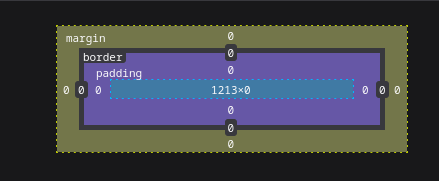

# Teoria

## Teoria HTTP

### 1. HTTP

HTTP è un protocollo a livello di applicazione e permette ai browser di comunicare con i server dei siti web per ricevere e visualizzare le pagine. Lo scambio di messaggi avviene tra client (browser) e server mediante richieste e risposte HTTP.
È un protocollo `stateless` ovvero ciascuna richiesta http è indipendente una dall'altra e il server non ne tiene traccia.

#### Formato Richiesta HTTP

- Linea di richiesta: `GET /api/products HTTP/1.1\n`
- Headers: `Host: localhost:3000\n`, `Connection: keep-alive\n`
- Riga vuota: `\n`

Nelle richieste `POST` è presente anche il body, nel quale ci sono i dati da inviare al server, di solito in formato JSON.

I metodi HTTP per effettuare le richieste sono:

1. `GET`: usato dal client per richiedere una risorsa al server, `GET http://localhost:3000/api/products`.
2. `HEAD`: il messaggio di risposta è simile a quella che restituirebbe il `GET`, il server non deve restituire il body.
3. `POST`: usato dal client per inviare dati al server, dati che sono passati nel body della richiesta.
4. `PUT`: usato dal client per modificare o crere una risorsa sul server.
5. `DELETE`: usato dal client per eliminare una risorsa presente nel server.
6. `PATCH`: usata per modificare una risorsa specificata nella URI.
7. `OPTIONS`: viene utilizzato per chiedere al server quali operazioni sono permesse su una risorsa o su un intero endpoint, è usato specialmente nelle applicazioni che comunicano traimite API.

#### Formato Risposte HTTP

- Linea di stato: `HTTP/1.1 200 OK\n`
- Headers: `Content-Type: application/json; charset=UTF-8\n`
- Riga vuota: `\n`
- Body: `{"id": 3}`

Il server poi in base al tipo di richiesta effettuata dal client, risponde con la risorsa richiesta insieme ad un codice di stato. Questi codici variano in base al tipo di richiesta effettuata dal client e al tipo di risposta del server. Alcuni codici importanti sono:

| Codice | Categoria        | Significato               | Descrizione                                                         |
|--------|------------------|---------------------------|---------------------------------------------------------------------|
| 200    | Successo         | OK                        | La richiesta è andata a buon fine.                                  |
| 201    | Successo         | Created                   | La risorsa è stata creata con successo (es. dopo un POST).          |
| 204    | Successo         | No Content                | La richiesta è andata bene, ma non c'è nulla da restituire.         |
| 301    | Reindirizzamento | Moved Permanently         | L'URL richiesto è stato spostato in modo permanente.                |
| 302    | Reindirizzamento | Found (Moved Temporarily) | L'URL è stato spostato temporaneamente.                             |
| 304    | Reindirizzamento | Not Modified              | La risorsa non è cambiata (usato per caching).                      |
| 400    | Errore client    | Bad Request               | La richiesta ha un formato errato o non può essere capita.          |
| 401    | Errore client    | Unauthorized              | Richiede autenticazione (ma non fornita o errata).                  |
| 403    | Errore client    | Forbidden                 | L’accesso è vietato, anche se autenticato.                          |
| 404    | Errore client    | Not Found                 | La risorsa richiesta non esiste.                                    |
| 405    | Errore client    | Method Not Allowed        | Il metodo HTTP usato non è permesso per quella risorsa.             |
| 409    | Errore client    | Conflict                  | C’è un conflitto con lo stato attuale della risorsa (es. doppione). |
| 500    | Errore server    | Internal Server Error     | Errore generico del server.                                         |
| 502    | Errore server    | Bad Gateway               | Il server ha ricevuto una risposta non valida da un altro server.   |
| 503    | Errore server    | Service Unavailable       | Il server non è disponibile (sovraccarico o in manutenzione).       |
| 504    | Errore server    | Gateway Timeout           | Il server non ha ricevuto risposta in tempo da un altro server.     |

| Header                       | Tipo      | Significato breve                                                    |
|------------------------------|-----------|----------------------------------------------------------------------|
| Host                         | Richiesta | Indica il dominio al quale si vuole accedere.                        |
| Content-Type                 | Entrambi  | Specifica il tipo di contenuto (es. application/json, text/html).    |
| Authorization                | Richiesta | Contiene le credenziali (es. token Bearer o Basic) per autenticarsi. |
| Accept                       | Richiesta | Indica il formato che il client si aspetta nella risposta.           |
| User-Agent                   | Richiesta | Descrive il client (browser, app, ecc.) che fa la richiesta.         |
| Origin                       | Richiesta | Usato nelle CORS: indica da dove proviene la richiesta.              |
| Access-Control-Allow-Origin  | Risposta  | Indica quali origini sono autorizzate (usato nelle CORS).            |
| Access-Control-Allow-Methods | Risposta  | Specifica i metodi HTTP consentiti per una risorsa.                  |
| Set-Cookie                   | Risposta  | Usato per inviare cookie dal server al client.                       |
| Location                     | Risposta  | Indica l’URL verso cui reindirizzare (usato nei 3xx).                |
| Cache-Control                | Risposta  | Controlla il comportamento della cache.                              |
| Content-Length               | Risposta  | Indica la dimensione del corpo della risposta, in byte.              |

### 2. CORS

Le `CORS (Cross-Origin Resource Sharing)` sono un meccanismo di sicurezza fondamentale nel mondo del web moderno, e servono per controllare l’accesso tra risorse che provengono da origini diverse. È uno standard W3C che permette a un sito web di accedere a risorse ospitate su un dominio diverso.

Supponiamo che la seguente app `(https://frontend.com)` voglia chiamare un'API `(https://api.backend.com)`. Il browser invia una richiesta e, prima ancora di permettere la vera comunicazione, può fare una richiesta preliminare, detta `preflight request`, con il metodo `OPTIONS`.

Questa richiesta chiede al server:

- Se è sicuro ricevere richieste da `https://frontend.com`
- Se può usare certi metodi (es. POST, PUT)
- Se può includere intestazioni particolari (es. Authorization, Content-Type)

Il server poi risponde con degli `header CORS`, i più importanti sono:

| Header                             | Significato                                                                  |
|------------------------------------|------------------------------------------------------------------------------|
| `Access-Control-Allow-Origin`      | Indica da quale origine si accettano richieste (es. `https://frontend.com`). |
| `Access-Control-Allow-Methods`     | Elenca i metodi HTTP consentiti (es. `GET, POST, PUT`).                      |
| `Access-Control-Allow-Headers`     | Specifica quali header sono ammessi nella richiesta.                         |
| `Access-Control-Allow-Credentials` | Se è `true`, consente l’uso di cookie o header di autenticazione.            |

Se la richiesta è “semplice” (cioè un GET o POST senza header particolari), allora non c’è bisogno del preflight.

### 3. REST API

Le `REST API (Representational State Transfer Application Programming Interface)` sono uno stile architetturale che definisce un metodo semplice e leggibile di comunicazione tra un applicazione (front-end) e un server mediante il protocollo `HTTP`. Tali pricipi architetturali sono:

- Usa il protocollo HTTP.
- Lavora con risorse, che sono entità come "utenti", "prodotti", etc...
- Ogni risorsa è identificata in modo univoco da un'URL.
- I dati sono di solito scambiati in formato JSON
- Si basa sui metodi HTTP (GET, POST, DELETE, PUT) ognuno con un significato specifico.

Per esempio, le API REST di un app che gestisce libri possono essere:

| Metodo | URL         | Azione                                |
|--------|-------------|---------------------------------------|
| GET    | `/libri`    | Ottieni la lista di tutti i libri     |
| GET    | `/libri/42` | Ottieni il libro con ID 42            |
| POST   | `/libri`    | Crea un nuovo libro                   |
| PUT    | `/libri/42` | Aggiorna **tutto** il libro con ID 42 |
| PATCH  | `/libri/42` | Aggiorna **una parte** del libro      |
| DELETE | `/libri/42` | Cancella il libro con ID 42           |

Le principali caratteriste dell'architettura REST API sono:

- È **semplice** da capire e usare (basta conoscere le URL e i metodi).
- È **indipendente** dalla tecnologia (un'app mobile in Swift può parlare con un server in Python, ad esempio).
- È **scalabile**: funziona bene anche quando il progetto cresce molto.
- È **stateless**: ogni richiesta contiene tutte le informazioni necessarie, non si mantiene uno "stato" lato server, il che semplifica la gestione.

## Teoria HTML

`HTML (HyperText Markup Language)` è un linguaggio di `markup` che serve per definire la struttura di una pagina web. Non è un linguaggio di programmazione: non contiene logica, ma dice al browser cosa mostrare (testi, immagini, link...) e come sono organizzati i contenuti.

In HTML, semantica significa usare i tag giusti per rappresentare il significato del contenuto, non solo per farlo apparire in un certo modo. Per esempio, invece di usare un generico `<div>` per tutto, possiamo usare tag come:

| Tag                         | Significato                                                          |
|-----------------------------|----------------------------------------------------------------------|
| `<main>`                    | Contenuto principale della pagina (una sola volta per pagina)        |
| `<section>`                 | Blocco di contenuto logico, spesso con un titolo (`<h2>`, `<h3>`...) |
| `<article>`                 | Contenuto indipendente e riutilizzabile (come un post o un commento) |
| `<aside>`                   | Contenuto secondario o correlato (sidebar, pubblicità, note)         |
| `<header>`                  | Intestazione della pagina o di una sezione                           |
| `<footer>`                  | Informazioni finali: autore, copyright, link legali                  |
| `<nav>`                     | Contiene link di navigazione tra sezioni o pagine                    |
| `<figure>` e `<figcaption>` | Per immagini con descrizione o didascalia                            |
| `<time>`                    | Per indicare date o orari, utile per motori di ricerca e calendari   |

L'HTML semantico è importante perché:

1. **Accessibilità**: i lettori di schermo possono "capire" la struttura della pagina, aiutando chi ha disabilità visive.
2. **SEO** (posizionamento sui motori di ricerca): Google e altri motori interpretano meglio il contenuto e lo classificano in modo più preciso.
3. **Manutenibilità**: è più facile leggere, modificare e collaborare su un codice ben strutturato.
4. **Compatibilità futura**: gli standard del web evolvono, ma l’HTML semantico è progettato per durare nel tempo.

[Tag HTML](https://www.w3schools.com/html/default.asp)

### Form

Una form in HTML è un contenitore che permette all’utente di inserire dati e poi inviarli al server. All’interno ci sono vari campi di input (testo, checkbox, pulsanti…) che l’utente compila.

| Tipo (`type`) | Descrizione                                                |
|---------------|------------------------------------------------------------|
| `text`        | Campo di testo a una riga                                  |
| `password`    | Campo di testo con caratteri nascosti                      |
| `email`       | Campo per inserire un indirizzo email (valida formato)     |
| `number`      | Campo per numeri (può avere min/max)                       |
| `tel`         | Campo per numero di telefono                               |
| `url`         | Campo per un indirizzo web                                 |
| `date`        | Selettore per una data (con calendario)                    |
| `time`        | Selettore per un orario                                    |
| `checkbox`    | Casella da spuntare (scelte multiple)                      |
| `radio`       | Pulsante di scelta esclusiva tra opzioni                   |
| `range`       | Slider per scegliere un valore entro un intervallo         |
| `color`       | Selettore per scegliere un colore                          |
| `file`        | Campo per caricare file                                    |
| `submit`      | Pulsante per inviare la form                               |
| `reset`       | Pulsante per **svuotare tutti i campi** del modulo         |
| `hidden`      | Campo invisibile usato per passare dati nascosti al server |
| `button`      | Pulsante generico (non invia la form di default)           |

| Tag          | Descrizione                                                   |
|--------------|---------------------------------------------------------------|
| `<textarea>` | Campo di testo multilinea (per messaggi, commenti, ecc.)      |
| `<select>`   | Menù a tendina per scegliere un’opzione                       |
| `<option>`   | Singola voce dentro il `<select>`                             |
| `<label>`    | Etichetta descrittiva per un campo (migliora l’accessibilità) |
| `<fieldset>` | Raggruppa visivamente e logicamente un insieme di campi       |
| `<legend>`   | Titolo del gruppo di campi dentro un `<fieldset>`             |

## Teoria CSS

`CSS (Cascading Style Sheets)` è il linguaggio che serve a definire lo stile di una pagina HTML: colori, font, dimensioni, layout, spaziatura, animazioni e molto altro.

- Inline
- Interno (dentro un tag `<style>`)
- Esterno (file .css separato)

```css
selettore {
    proprietà: valore;
}
```

### Selettori

I `selettori` CSS sono le “chiavi” che dicono al browser a quali elementi HTML applicare un certo stile.

1. `Parent (genitore)`: un elemento che contiene direttamente un altro.
2. `Child (figlio)`: un elemento contenuto direttamente in un altro.
3. `Descendant (discendente)`: un figlio o qualunque elemento annidato dentro (anche più livelli sotto).
4. `Sibling (fratello)`: due elementi che stanno allo stesso livello, dentro lo stesso genitore.

- **Discendente (spazio)**

```css
  div p {
    color: blue;
}
```

Colpisce tutti i `<p>` dentro un `<div>`, anche se sono annidati più in profondità. È il più "largo" e generale.

- **Figlio diretto (`>`)**

```css
ul > li {
    list-style-type: square;
}
```

Colpisce solo i `<li>` che sono figli diretti di `<ul>`, non i nipoti.

- **Fratello immediato (`+`)**

```css
h1 + p {
    margin-top: 0;
}
```

Colpisce il primo `<p>` subito dopo un `<h1>`, se sono fratelli diretti.

- **Fratelli generici (`~`)**

```css
h1 ~ p {
    color: red;
}
```

Colpisce tutti i paragrafi fratelli successivi di un `<h1>`.

### Specificità selettori

La `specificità` è una regola che il browser usa per decidere quale stile applicare quando più dichiarazioni CSS potrebbero colpire lo stesso elemento.

La specificità si calcola con un sistema a 4 valori, spesso indicato come una tupla: $\left(A, B, C, D\right)$, dove ogni lettera rappresenta un tipo di selettore.

| Tipo di selettore                | Lettera | Esempio                   | Valore  |
|----------------------------------|---------|---------------------------|---------|
| Stili inline (scritti in HTML)   | A       | `<div style="color:red">` | 1,0,0,0 |
| Selettori ID                     | B       | `#header`                 | 0,1,0,0 |
| Classi, attributi, pseudo-classi | C       | `.box`, `[type="text"]`   | 0,0,1,0 |
| Elementi, pseudo-elementi        | D       | `div`, `p`, `::before`    | 0,0,0,1 |

- Se un selettore combina più di questi, i valori si sommano.
- Più a sinistra è il numero più `pesante`, quindi $\left(0, 1, 0, 0\right)$ batte $\left(0, 0, 100, 0\right)$.

#### Esempi

| Selettore                                             | Inline (A) | ID (B)                            | Classi / Attributi / Pseudo-classi (C) | Elementi / Pseudo-elementi (D)        | Specificità |
|-------------------------------------------------------|------------|-----------------------------------|----------------------------------------|---------------------------------------|-------------|
| `*`                                                   | 0          | 0                                 | 0                                      | 0                                     | `0,0,0,0`   |
| `li`                                                  | 0          | 0                                 | 0                                      | 1                                     | `0,0,0,1`   |
| `li::first-line`                                      | 0          | 0                                 | 0                                      | 2 (`li` + `::first-line`)             | `0,0,0,2`   |
| `ul li`                                               | 0          | 0                                 | 0                                      | 2 (`ul` + `li`)                       | `0,0,0,2`   |
| `ul ol li`                                            | 0          | 0                                 | 0                                      | 3                                     | `0,0,0,3`   |
| `h1 + *[rel=up]`                                      | 0          | 0                                 | 1 (`[rel=up]`)                         | 2 (`h1` + `*`)                        | `0,0,1,2`   |
| `ul ol li.red`                                        | 0          | 0                                 | 1 (`.red`)                             | 3 (`ul`, `ol`, `li`)                  | `0,0,1,3`   |
| `li.red.level`                                        | 0          | 0                                 | 2 (`.red`, `.level`)                   | 1 (`li`)                              | `0,0,2,1`   |
| `#x34y`                                               | 0          | 1                                 | 0                                      | 0                                     | `0,1,0,0`   |
| `style=""` (inline style)                             | 1          | 0                                 | 0                                      | 0                                     | `1,0,0,0`   |
| `html body div#pagewrap ul#summer-drinks li.favorite` | 0          | 2 (`#pagewrap`, `#summer-drinks`) | 1 (`.favorite`)                        | 5 (`html`, `body`, `div`, `ul`, `li`) | `0,2,1,5`   |

### Font

I `font` sono elementi fondamentali nel web design, influenzando la leggibilità, l'estetica e l'esperienza utente di un sito. Nel contesto del web, possiamo distinguere principalmente tra font di sistema e web font.

- I `font di sistema` sono preinstallati sui dispositivi degli utenti e utilizzati direttamente dal sistema operativo. Esempi comuni includono `Arial, Times New Roman e Verdana`.
- I `web font` sono caratteri tipografici scaricati da un server al momento del caricamento della pagina web.

Il termine `font stack` in CSS si riferisce alla lista ordinata di font che il browser deve provare a usare per un determinato elemento. Questa lista viene definita nella proprietà `font-family`, e serve a garantire che, se il primo font non è disponibile, il browser passi al successivo, fino a trovare uno disponibile sul sistema dell’utente.

```css
body {
    font-family: "Helvetica Neue", Helvetica, Arial, sans-serif;
}
```

- "Helvetica Neue": è il primo font preferito, ma non sempre disponibile.
- Helvetica: un font molto simile, come alternativa.
- Arial: un font di sistema comune su Windows.
- sans-serif: una famiglia generica, usata come ultima risorsa. (es. Arial, Verdana, ecc.).

Alcune "categorie" generiche di font, usate come fallback finale:

- `serif`: font con grazie (es. Times New Roman)
- `sans-serif`: senza grazie (es. Arial)
- `monospace`: caratteri a larghezza fissa (es. Courier New)

### Box



Ogni elemento html è contenuto in un box rettangolare. Le 4 dimensioni importanti sono:

1. **Content**
    È l’area centrale, dove risiede il contenuto vero e proprio dell’elemento: testo, immagini, input, ecc.
2. **Padding**
    È lo spazio interno tra il contenuto e il bordo. Serve a distanziare il contenuto dal bordo.
    Valore assente esplicitamente, ma visibile come area vuota intorno al contenuto.
3. **Border**
    È il bordo vero e proprio che circonda il padding e il contenuto.
4. **Margin**
    È lo spazio esterno tra l’elemento e gli altri elementi della pagina.
    Non influenza la dimensione visiva interna, ma la distanza dell’elemento dagli altri.

Per calcolare lo spazio occupato da un elemento nel flusso del documento (in modalità content-box), la formula è:

- `Larghezza totale = content + padding sx + padding dx + border sx + border dx + margin sx + margin dx`
- `Altezza totale = content + padding top + padding bottom + border top + border bottom + margin top + margin bottom`

In CSS abbiamo due modalità di calcolo:

1. `box-sizing: content-box;` -  Solo content è incluso nella width e height. Padding e border si aggiungono.
2. `box-sizing: border-box;` - `width` e `height` includono `content + padding + border`. Molto più prevedibile per layout responsive.

### Position

Di default, gli elementi HTML seguono il flusso normale del documento. I blocchi (come `div, p, h1, section`) si dispongono uno sotto l'altro, mentre gli inline (come `span, a, strong`) si affiancano orizzontalmente.

Per modificare la posizione degli elementi HTML si utilizza la proprietà CSS `position`:

- `static`: è il valore predefinito. L'elemento segue il flusso normale della pagina, senza alcun posizionamento speciale.
- `relative`: permette di "muovere" un elemento rispetto alla sua posizione originale. L'elemento occupa ancora il suo spazio, ma si può spostare con `top, left, bottom, right`.
- `absolute`: rimuove l'elemento dal flusso e lo posiziona rispetto al primo antenato con `position: relative` o simile. È utile per sovrapporre o ancorare elementi in posizione precise.
- `fixed`: come `absolute`, ma posiziona l'elemento rispetto alla finestra del browser, quindi resta fisso anche quando si scrolla.

Un altra proprietà usata per il posizionamento degli elementi è `float`. Permette di muovere un elemento tutto a destra o tutto a sinistra permettendo agli altri elementi di circondarlo. L'elemento a cui viene applicata la proprietà `float` esce dal flusso normale del documento, influenzado il contenuto dei blocchi attorno. In pasasto veniva usato per definire il layout della pagina ma adesso non è piu usato in quanto si usa `flex` e `grid`.

### Layout

#### Flex

Flexbox si basa su due livelli di elementi:

1. Il contenitore flessibile, a cui si dà `display: flex`
2. I suoi figli diretti, che vengono automaticamente gestiti dal sistema Flexbox.

- **Proprietà del contenitore flex:**

| **Proprietà**     | **Descrizione**                                                                                                                                       |
|-------------------|-------------------------------------------------------------------------------------------------------------------------------------------------------|
| `display`         | Attiva il layout flex. Valori: `flex` (blocco) o `inline-flex` (inline).                                                                              |
| `flex-direction`  | Imposta la direzione degli elementi: `row`, `row-reverse`, `column`, `column-reverse`.                                                                |
| `flex-wrap`       | Permette agli elementi di andare a capo se non c'è spazio: `nowrap` (default), `wrap`, `wrap-reverse`.                                                |
| `flex-flow`       | Shorthand per `flex-direction` e `flex-wrap`. Es: `flex-flow: row wrap;`.                                                                             |
| `justify-content` | Allinea gli elementi lungo l'asse principale (es. orizzontale): `flex-start`, `center`, `flex-end`, `space-between`, `space-around`, `space-evenly`.  |
| `align-items`     | Allinea gli elementi lungo l'asse secondario (es. verticale): `stretch` (default), `flex-start`, `center`, `flex-end`, `baseline`.                    |
| `align-content`   | Allinea le righe multiple (quando c’è wrapping), lungo l’asse secondario. Funziona solo se ci sono **più righe**. Stessi valori di `justify-content`. |

- **Proprietà dei figli**

| **Proprietà** | **Descrizione**                                                                                                                                                           |
|---------------|---------------------------------------------------------------------------------------------------------------------------------------------------------------------------|
| `flex-grow`   | Indica **quanto** un elemento può crescere per occupare lo spazio disponibile. Es: `flex-grow: 1` fa crescere in modo proporzionale.                                      |
| `flex-shrink` | Indica **quanto** un elemento può restringersi se non c’è spazio. Es: `flex-shrink: 0` impedisce che si riduca.                                                           |
| `flex-basis`  | Definisce la **dimensione iniziale** dell’elemento, prima che Flexbox ridistribuisca gli spazi. Può essere una misura (es. `200px`, `30%`).                               |
| `flex`        | Shorthand per `flex-grow`, `flex-shrink` e `flex-basis`. Es: `flex: 1` è equivalente a `1 1 0`.                                                                           |
| `align-self`  | Permette a un singolo elemento di allinearsi diversamente dagli altri lungo l'asse secondario. Valori: `auto`, `flex-start`, `center`, `flex-end`, `baseline`, `stretch`. |
| `order`       | Cambia l’**ordine visuale** di un elemento rispetto agli altri (senza modificare l’HTML). Valore numerico: più piccolo viene prima. Default: `order: 0`.                  |

#### Grid

CSS Grid è un sistema di layout che consente di creare griglie complesse senza dover ricorrere a float, margin complicati o JavaScript. Ogni elemento può essere disposto in righe e colonne, decidendo:

- Quante colonne e righe ci sono
- Quanto spazio occupa ogni cella
- Dove va ogni elemento all’interno della griglia

Si basa sempre su due livelli:

1. Il contenitore: a cui si applica `display: grid` o `display: inline-grid`.
2. Gli elementi figli, che si collocano in posizioni precise.

- **Proprietà del contenitore Grid**

| **Proprietà**           | **Descrizione**                                                                                                 |
|-------------------------|-----------------------------------------------------------------------------------------------------------------|
| `display`               | Attiva il layout Grid. Usa `grid` o `inline-grid`.                                                              |
| `grid-template-columns` | Definisce **quante colonne** ha la griglia e la **larghezza di ciascuna**. Es: `1fr 2fr 1fr`, `repeat(3, 1fr)`. |
| `grid-template-rows`    | Come sopra, ma per le **righe**. Es: `100px auto 1fr`.                                                          |
| `grid-template-areas`   | Assegna **nomi visivi alle aree** della griglia. Serve per layout leggibili e semantici.                        |
| `grid-template`         | Shorthand per definire righe, colonne e aree in una sola proprietà.                                             |
| `grid-auto-rows`        | Definisce la **dimensione automatica** delle righe che non sono dichiarate.                                     |
| `grid-auto-columns`     | Come sopra, ma per colonne automatiche.                                                                         |
| `grid-auto-flow`        | Imposta il **flusso automatico** degli elementi: `row`, `column`, `row dense`, `column dense`.                  |
| `gap`                   | Spazio tra righe e colonne. Valore singolo o doppio. Es: `gap: 10px 20px;`.                                     |
| `row-gap`, `column-gap` | Permettono di specificare separatamente il gap verticale e orizzontale.                                         |
| `justify-items`         | Allinea gli **elementi nelle celle** lungo l’asse orizzontale. Es: `start`, `end`, `center`, `stretch`.         |
| `align-items`           | Allinea gli **elementi nelle celle** verticalmente.                                                             |
| `justify-content`       | Allinea **l'intera griglia** nel contenitore, orizzontalmente.                                                  |
| `align-content`         | Allinea **l'intera griglia** nel contenitore, verticalmente.                                                    |

- **Proprietà degli elementi figli**

| **Proprietà**       | **Descrizione**                                                                                                                  |
|---------------------|----------------------------------------------------------------------------------------------------------------------------------|
| `grid-column-start` | Inizia alla **colonna X**. Es: `grid-column-start: 2`.                                                                           |
| `grid-column-end`   | Finisce alla **colonna Y**. Es: `grid-column-end: 4`.                                                                            |
| `grid-row-start`    | Inizia alla **riga X**.                                                                                                          |
| `grid-row-end`      | Finisce alla **riga Y**.                                                                                                         |
| `grid-column`       | Shorthand: `start / end`. Es: `grid-column: 2 / 4`.                                                                              |
| `grid-row`          | Come sopra, ma per le righe.                                                                                                     |
| `grid-area`         | Può essere il nome di un’area dichiarata in `grid-template-areas`, oppure 4 numeri: `row-start / col-start / row-end / col-end`. |
| `justify-self`      | Allinea **il singolo elemento** orizzontalmente nella sua cella.                                                                 |
| `align-self`        | Allinea **il singolo elemento** verticalmente nella cella.                                                                       |
| `place-self`        | Shorthand di `align-self` e `justify-self`. Es: `place-self: center end`.                                                        |

### Responsive

Per pagine responsive si intende la creazione di layout che si adatta in automatico alla dimensione dello schermo. Ci sono varie tecniche per la creazione di layout responsive.

#### 1. Viewport meta tag

Questo tag va sempre inserito nell'`head` di ogni documento HTML per dire al browser di adattarsi alla larghezza del dispositivo.
`<meta name="viewport" content="width=device-width, initial-scale=1.0">`

#### 2. Media Queries

Le media query sono delle regole CSS che vengono applicate solo quando certe condizioni sono vere, come ad esempio la larghezza dello schermo.

```css
@media (max-width: 768px) {
    .contenitore {
        flex-direction: column;
    }
}
```

Questa regola viene applicata solo se la larghezza dello schermo è 768px o meno.

Il CSS responsive di può scrivere in due modi: Mobile First o Desktop First.

- **Mobile First**

L'idea è quella di scrivere il CSS per gli schermi piccoli, poi espandere mediante media query con `min-width` per schermi più grandi.

```css
/* Base: mobile */
body {
    font-size: 16px;
    display: flex;
    flex-direction: column;
}

/* Tablet e oltre */
@media (min-width: 768px) {
    body {
        flex-direction: row;
    }
}

/* Desktop largo */
@media (min-width: 1200px) {
    body {
        max-width: 1200px;
        margin: 0 auto;
    }
}
```

- **Desktop First**

L'idea invece è quella di scrivere il CSS per schermi grandi, poi addatarlo a schermi più piccoli con le media query con `max-width`.

```css
/* Base: desktop largo */
body {
    font-size: 16px;
    display: flex;
    flex-direction: row;
    max-width: 1200px;
    margin: 0 auto;
}

/* Tablet e più piccoli */
@media (max-width: 1199px) {
    body {
        max-width: 100%;   /* togliamo il limite massimo */
        margin: 0;         /* eliminiamo i margini */
    }
}

/* Mobile */
@media (max-width: 767px) {
    body {
        flex-direction: column; /* impila gli elementi in verticale */
    }
}

```

## Teoria JS

Nel front-end, JavaScript serve per:

- Interagire con la pagina HTML (DOM)
- Gestire eventi (click, input, caricamento, ecc.)
- Manipolare stili, classi e contenuti dinamicamente
- Comunicare con server (es. via fetch)
- Controllare il flusso logico e rispondere alle azioni dell’utente

### Caratteristiche di JS

1. È un liguaggio interpretato dal browser in tempo reale.
2. È orientato agli oggetti, ma non segue il classico paradigma "a classi" di JAVA o C++. Il meccanismo alla base è la programmazione basata su prototipi. Ogni oggetto può ereditare proprietà da un altro oggetto, chiamato prototipo. Gli oggetti in JS sono una lista di coppie `key-value` (JSON).
3. Non è tipizzato
4. Debolmente tipizzato (`5 == "5" // true`, si usa `===` per confrontare anche il tipo dei dati)
5. JS è guidato dagli eventi, cioè reagisce a ciò che succede nella pagina e supporta la programmazione asincrona.
6. JS esegue tutto su un solo thread, ma grazie all'event loop può gestire molte cose contemporaneamente.
7. Dispone di una garbage collector, un algoritmo che capisce quali variabili e oggetti non sono piu utili e li rimuove dalla memoria.

| Funzione / Metodo                      | A cosa serve                                                    | Esempio rapido                                             |
|----------------------------------------|-----------------------------------------------------------------|------------------------------------------------------------|
| `document.querySelector()`             | Seleziona il **primo** elemento con un selettore CSS            | `document.querySelector(".btn")`                           |
| `document.querySelectorAll()`          | Seleziona **tutti** gli elementi che corrispondono al selettore | `document.querySelectorAll("div.card")`                    |
| `document.getElementById()`            | Seleziona un elemento per `id`                                  | `document.getElementById("header")`                        |
| `element.addEventListener()`           | Assegna un **gestore di eventi** a un elemento                  | `btn.addEventListener("click", funzione)`                  |
| `element.classList.add()`              | Aggiunge una o più classi CSS all’elemento                      | `box.classList.add("attivo")`                              |
| `element.classList.remove()`           | Rimuove una o più classi                                        | `box.classList.remove("attivo")`                           |
| `element.classList.toggle()`           | Aggiunge o rimuove una classe **in base allo stato attuale**    | `btn.classList.toggle("on")`                               |
| `element.innerText / innerHTML`        | Legge o imposta il contenuto testuale o HTML                    | `div.innerText = "Ciao"`                                   |
| `element.style.property`               | Modifica uno stile direttamente (inline)                        | `box.style.backgroundColor = "red"`                        |
| `setTimeout()`                         | Esegue una funzione **dopo un certo tempo**                     | `setTimeout(() => alert("Ciao"), 2000)`                    |
| `setInterval()`                        | Esegue una funzione **ripetutamente ogni intervallo**           | `setInterval(() => console.log("tick"), 1000)`             |
| `clearTimeout()` / `clearInterval()`   | Ferma un `setTimeout` o `setInterval`                           | `clearInterval(id)`                                        |
| `event.preventDefault()`               | Impedisce il comportamento predefinito (es. invio di un form)   | `form.addEventListener("submit", e => e.preventDefault())` |
| `window.addEventListener("load")`      | Esegue qualcosa **quando la pagina è completamente caricata**   | `window.addEventListener("load", init)`                    |
| `JSON.stringify()` / `JSON.parse()`    | Converte oggetti in stringa JSON e viceversa                    | `localStorage.setItem("user", JSON.stringify(obj))`        |
| `localStorage.getItem()` / `setItem()` | Salva o recupera dati locali persistenti                        | `localStorage.getItem("nome")`                             |
| `fetch()`                              | Fa una richiesta HTTP (es. API)                                 | `fetch("/api").then(r => r.json())`                        |

### Prototipi, costruttori ed ereditarietà

- Un oggetto è una collezione di proprietà, dove ogni proprietà ha un nome (chiave) e un valore. Gli oggetti sono alla base di JavaScript, e tutto (inclusi array e funzioni) può essere considerato un oggetto o derivato da esso.
- Un costruttore è una funzione speciale che viene usata per creare più oggetti con la stessa "struttura". È un modo per "produrre oggetti" simili.

```Javascript
function Persona(nome, età) {
    this.nome = nome;
    this.età = età;
    this.saluta = function() {
        console.log(`Ciao, sono ${this.nome}`);
    }
}

const persona1 = new Persona("Marco", 25);
const persona2 = new Persona("Giulia", 28);
```

- Per evitare la duplicazione dei metodi, JavaScript utilizza i prototipi. Un prototipo è un oggetto dal quale altri oggetti possono ereditare proprietà e metodi. Ogni funzione costruttrice ha una proprietà prototype, e ogni oggetto creato con quella funzione eredita automaticamente da quel prototipo.

```javascript
function Person(name){
    this.name = name
    this.sayHi = function(){
    return 'Hi, I am ' + this.name
    }
}
```

In questo caso ogni qualvolta che viene creato un oggetto di tipo `Person`, esso conterrà al suo interno il metodo `sayHi`.

```javascript
function Person(name){
    this.name = name
}
Person.prototype.sayHi = function(){
    return 'Hi, I am ' + this.name
}
```

In questo caso invece, ciascun oggetto `Person` contiene al suo interno solo la proprietà `name` e il metodo `sayHi` viene ereditato dal suo prototipo, quindi in memoria c'è un'unica istanza di tale metodo, il che è molto piu efficiente da un punto di vista di gestione della memoria.

- Quando chiamiamo una proprietà di un oggetto, prima si cerca tra le proprietà dell’oggetto, poi tra le proprietà del prototipo e infine  tra le proprietà del prototipo del prototipo etc... `[Prototype chain]`.

```Javascript
function Persona(nome, età) {
    this.nome = nome;
    this.età = età;
}

Persona.prototype.saluta = function() {
    console.log(`Ciao, sono ${this.nome}`);
};

const persona1 = new Persona("Marco", 25);
persona1.saluta(); // Usa il metodo ereditato dal prototipo
```

Il metodo `saluta` è ora condiviso tra tutte le istanze, perché viene ereditato dal prototipo. Questo è molto più efficiente in termini di memoria.
Poiché non possiamo aggiungere direttamente proprietà o metodi ad un oggetto creato mediante costruttore, dobbiamo aggiungere la proprietà o il metodo nel costruttore stesso oppure mediante l'utilizzo della proprietà `prototype`. Così facendo tutte le istanze ereditarieranno la nuova proprietà dal prototipo.
